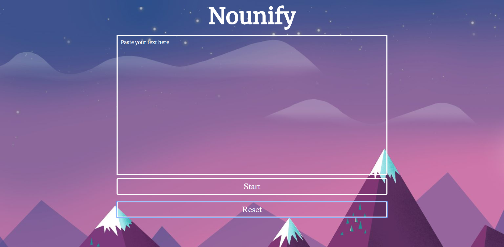
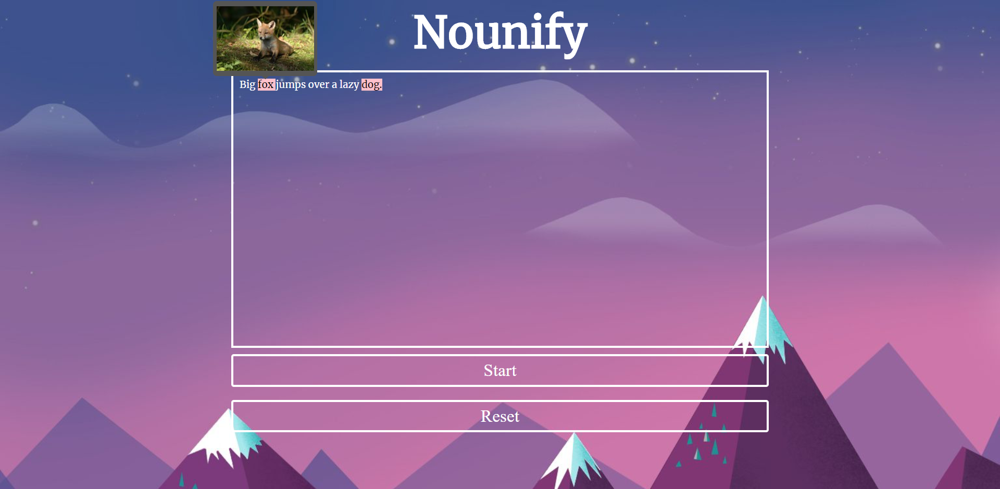

# Nounify

Nounify is a simple application which will help parents read and visually enrich stories with their children.

The main UI contains the text input and two buttons: Start and Reset. 

The user will insert the text to the input and click Start. After this the page will call an API to figure out which words in the text can be treated as nouns. The code will then highlight all such words in the text. 
If the user clicks the highlighted word, the code will call another API to get a random image for the given noun and display it in a popup above the word. 

The user can clear up the text and all the images by clicking Reset button.

After the user presses Start button:

Link to the website: 
https://ninjagirl2018.github.io/Nounify/
