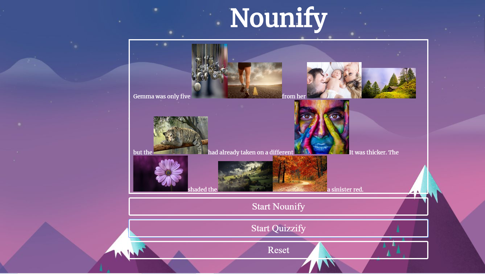

# Nounify

Nounify is a simple application which will help parents and educattors visually enrich the story experience with their children and students.

The main UI contains the text input and three buttons: Nounify, Quizify and Reset. 

The user will insert the text to the input and click Start. After this the page will call an API which will parse out which words in the text can be treated as nouns. The code will then highlight all such words in the text. 

If the user clicks the highlighted word, the code will call another API to pull in a random image for the given noun and display it in a popup above the word. 

The user can then clear the text and all the images by clicking Reset button.

After the user presses Start button:

# ... Quizify

If a user clicks Quizify button, the API will be called to figure out which words in the text can be treated as nouns, then another API will be called right away for all words which are nouns, to obtain random pictures of those words. The system will then substitute all nouns with respective images. 

Once a user clicks on an image, the input field will appear prompting a user to enter a word. If the user guesses the word (and the spelling) correctly, a "Good job" message will be displayed, and the picture in the text will be permanently substituted with a word. If the user doesn't guess, the "Try again" message will appear instead. 

Once the user guesses all the words on a page, "All done!" message will be displayed. This will be the end of the game. 

At any time user can still exit the game by pressing "Reset" button. 

Link to the website: 
https://ninjagirl2018.github.io/Nounify/
